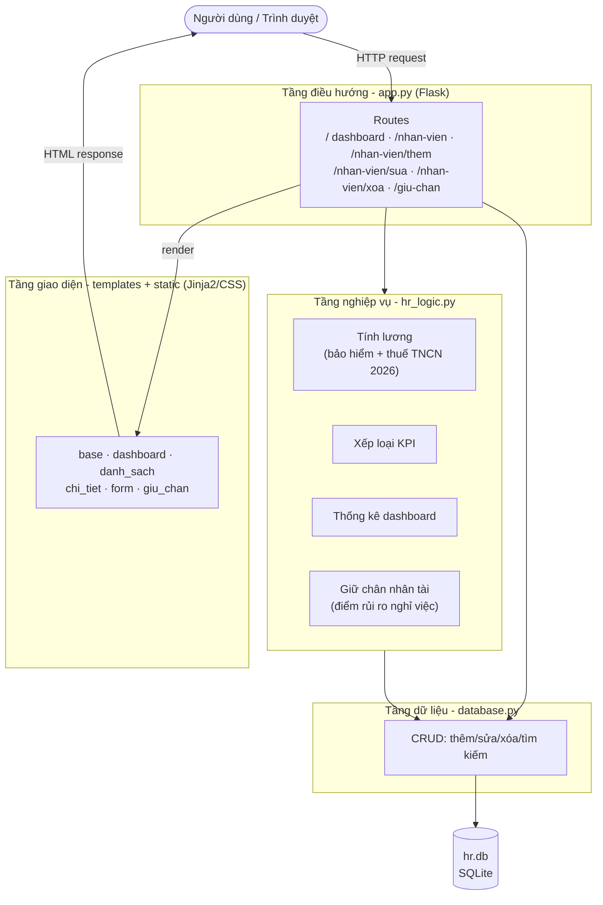
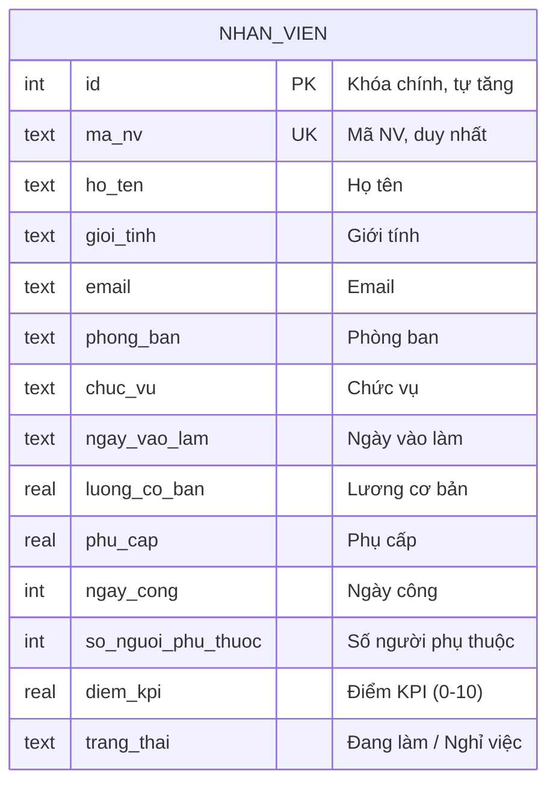
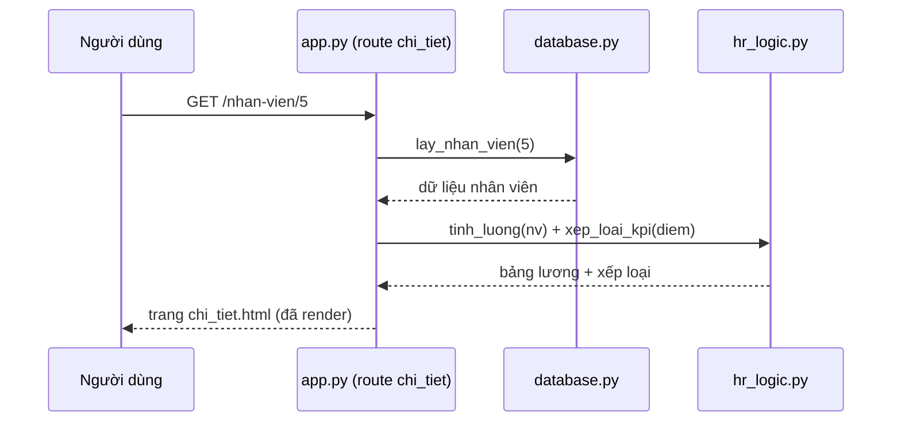

# Sơ đồ mô hình hệ thống quản lý nhân sự

Tài liệu mô tả kiến trúc và mô hình dữ liệu của ứng dụng. Các sơ đồ viết bằng
[Mermaid](https://mermaid.js.org/) nên GitHub tự render trực tiếp dưới đây.
Bản ảnh vector kèm theo: [`kien-truc.svg`](kien-truc.svg) và
[`mo-hinh-du-lieu.svg`](mo-hinh-du-lieu.svg).

## 1. Kiến trúc hệ thống (kiến trúc phân tầng)

Ứng dụng tách thành 4 tầng rõ ràng, mỗi tầng một file/thư mục:

**Nguyên tắc:** tầng trên gọi tầng dưới, không ngược lại. Giao diện không truy
cập trực tiếp database; mọi nghiệp vụ (lương, thuế, KPI, rủi ro) nằm gọn trong
`hr_logic.py` để dễ kiểm thử và thay đổi.

## 2. Mô hình dữ liệu

Toàn bộ dữ liệu nằm trong một bảng `nhan_vien` (SQLite):

## 3. Luồng xử lý một yêu cầu (ví dụ: xem chi tiết nhân viên)

